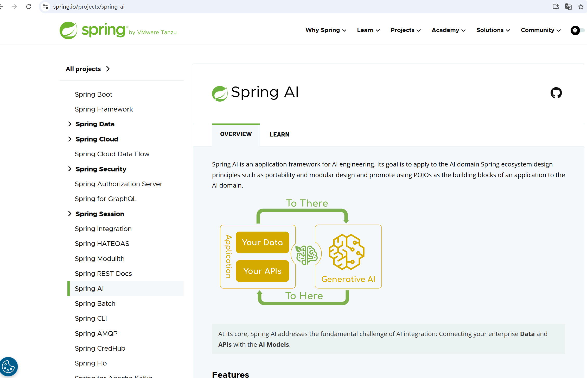

# SpringAI  Demo

## 1.spring AI 初识
官网地址：
https://spring.io/projects/spring-ai

## 2.单模态模型
### 2.1 集成openai聊天模型
参考地址：
https://docs.spring.io/spring-ai/reference/api/chat/openai-chat.html

参考代码：
模块：spring-ai-01-chat

### 2.2 集成openai文生图模型
参考地址：
https://docs.spring.io/spring-ai/reference/api/image/openai-image.html

模块：spring-ai-02-image

### 2.3 集成openai音频翻译模型
参考地址：
https://docs.spring.io/spring-ai/reference/api/audio/transcriptions/openai-transcriptions.html

模块：spring-ai-03-audio

### 2.4 集成openai文本翻译音频模型
参考地址：
https://docs.spring.io/spring-ai/reference/api/audio/speech/openai-speech.html

模块：spring-ai-04-tts

详细外链接地址：
https://www.yuque.com/alipayay3frwkcw1/argbpl/vtgtbpezu2zs23lq/edit?toc_node_uuid=Ji2Z8YVz2WlS8Cw2#rvfgh

